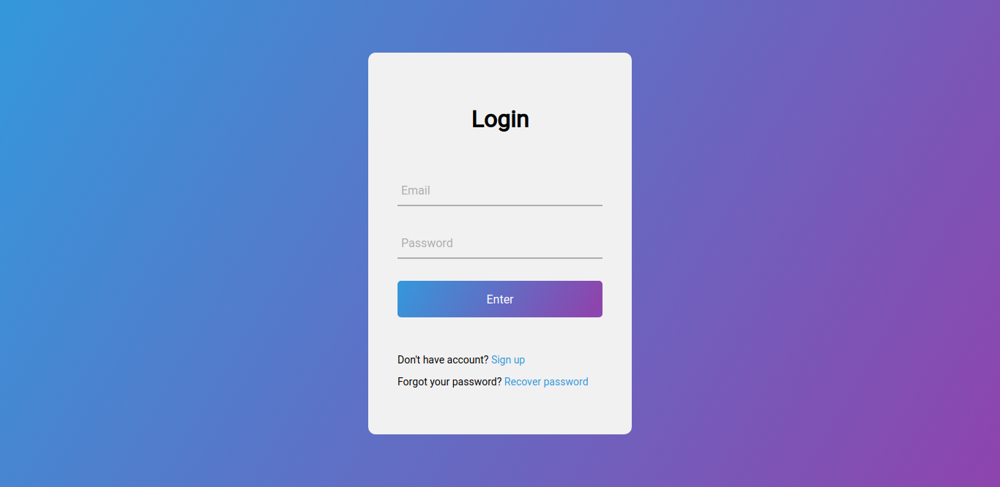

<h1 align="center">

</h1>

<h3 align="center">
Just a beautiful Animated Login Form Using React.js
</h3>

# Login

## Overview

DarkCode Video Based Login Form. [Video Link](https://www.youtube.com/watch?v=ZvU57lTnNgo)

## Modules

- [React](https://github.com/facebook/react) - React is a JavaScript library for building user interfaces.
- [React Router](https://github.com/ReactTraining/react-router) - Declarative routing for React.
- [Styled Component](https://github.com/styled-components/styled-components) - Visual primitives for the component age.

And there's more in the project [package.json](https://github.com/oifelipesan/ntask-api/blob/master/package.json).

## Installation

- Clone the repository: `git clone git@github.com:oifelipesan/login-react.git`
- Access the project directory: `cd login-react`
- Install the dependencies: `yarn install` or `npm install`
- Start: `yarn start` or `npm start`

## Routes

Login: `/`  
Register: `/register`  
Forgot Password: `/forgot`  
Reset Passqord: `/reset`
